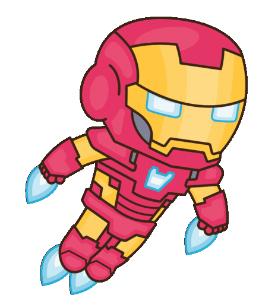
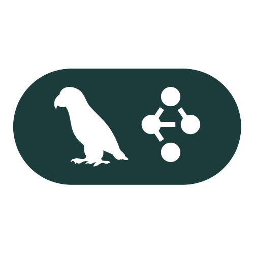
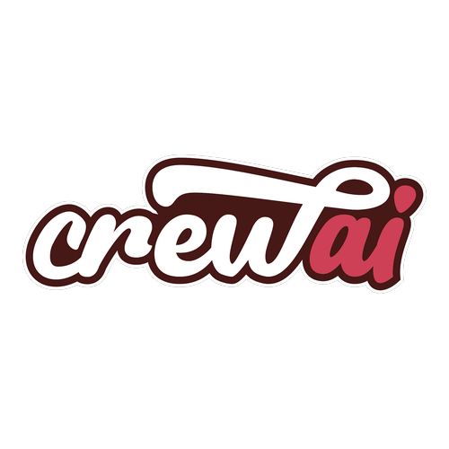
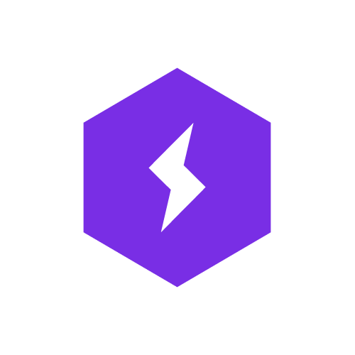
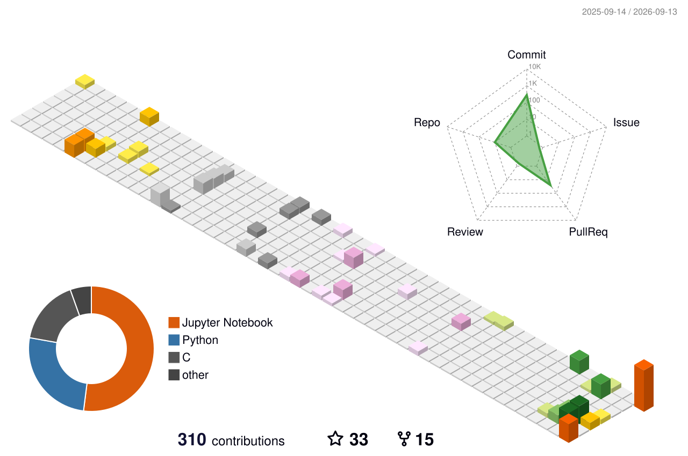

# Hi, I am Sushovan 👨‍🎓!

  

### 🤖 Founding AI / ML Engineer &nbsp;|&nbsp; 🎓 M.Tech Data Science (IIT Guwahati) &nbsp;|&nbsp; 🏅 Kaggle Notebook Expert

  &nbsp;
  &nbsp;
  &nbsp;
  &nbsp;
  &nbsp;
  

---

###  About Me

-  Hi there! I'm **Sushovan Saha** — a passionate **Machine Learning (ML)** practitioner with deep interests in **Machine Learning (ML)**, **Deep Learning**, **Natural Language Processing (NLP)**, **Computer Vision (CV)**, and the transformative capabilities of **Large Language Models (LLMs)** and **Gen AI**. Currently working as a founding **AI Engineer** at a Stealth Startup.
        
-  I hold an **M.Tech in Data Science** from **IIT Guwahati**, and I’m currently a **Kaggle Notebook Expert** with a strong inclination toward solving real-world challenges using intelligent systems. Currently working as a founding **Machine Learning Engineer** at a Stealth Startup.

---

###  My Skills

- 🧠 **LLMs & Generative AI**: Proficient in **RAG, GraphRAG, Agentic RAG, MCP, LangChain, LangGraph, Google ADK**, and architecting **Complex Agentic Workflows**  
- 🎙️ **Voice Agents & Real-Time AI**: Building end-to-end real-time **Voice Agents** using **LiveKit**, WebRTC, low-latency audio pipelines, and tool-augmented conversational agents  
- 🎯 **Fine-Tuning & Post-Training (Reasoning & RL)**: Hands-on experience with **SFT** (Supervised Fine-Tuning) and **GRPO** (Group Relative Policy Optimization) on **Qwen3.5 4B**, leveraging **HuggingFace, Unsloth, PyTorch, and PyTorch Lightning**  
- 🔬 **Applied ML & Deep Learning**: End-to-end project experience across NLP, Computer Vision (CV), and Time Series domains  
- 📈 **Time Series & Forecasting**: Statistical and deep learning models for trend analysis, predictive modeling, and demand **Forecasting**  
- ⚙️ **MLOps & Scalable ML Systems**: Focus on production-grade pipelines, model deployment, and monitoring with **MLflow**  
- 🚀 **API & Deployment**: Experience in deploying models as APIs using **FastAPI** and deploying on cloud platforms like **AWS and GCP**  
- 🔄 **CI/CD**: Experience in setting up CI/CD pipelines using **GitHub Actions**  
- 📊 **Data Science**: Experience in data analysis, statistical analysis, data visualization, and data preprocessing using **Pandas, NumPy, Matplotlib, Seaborn, and Scikit-learn**  

 

#### 🛠️ Frameworks & Ecosystem

   &nbsp;&nbsp;
   &nbsp;&nbsp;
   &nbsp;&nbsp;
   &nbsp;&nbsp;
   &nbsp;&nbsp;
   &nbsp;&nbsp;
   &nbsp;&nbsp;
   &nbsp;&nbsp;
   &nbsp;&nbsp;
   &nbsp;&nbsp;
   &nbsp;&nbsp;
   &nbsp;&nbsp;
   &nbsp;&nbsp;
  

  

---

###  Featured App

Explore my latest project powered by Gen AI agents and real-time research:  
👉 **[AI Research Agent App](https://ambidextrous.streamlit.app/)** &nbsp; 

---

###  In my free time, you’ll find me:

- Contributing to the ML community on [Kaggle](https://www.kaggle.com/sushovansaha9)
- Writing practical ML blogs on [Medium](https://medium.com/@sushovansaha95)
- Exploring new AI tools, frameworks, and academic papers to stay at the cutting edge

 

>  **I'm always eager to collaborate on innovative projects, exchange ideas, and learn from the community. Let’s build something amazing with AI!** 

 

---

### 📊 GitHub Activity & Stats

<em>Thank you for visiting my GitHub profile!</em>

  

<picture>
  <source media="(prefers-color-scheme: dark)" srcset="snake/github-snake-dark.svg">
  <source media="(prefers-color-scheme: light)" srcset="snake/github-snake.svg">
  
</picture>

  

<picture>
  <source media="(prefers-color-scheme: dark)" srcset="profile-3d-contrib/profile-night-rainbow.svg">
  <source media="(prefers-color-scheme: light)" srcset="profile-3d-contrib/profile-season-animate.svg">
  
</picture>

---

### ✍️ My Medium Blogs

 

  

  

